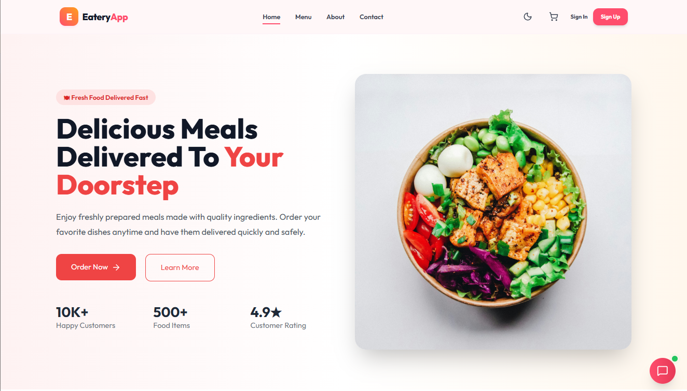
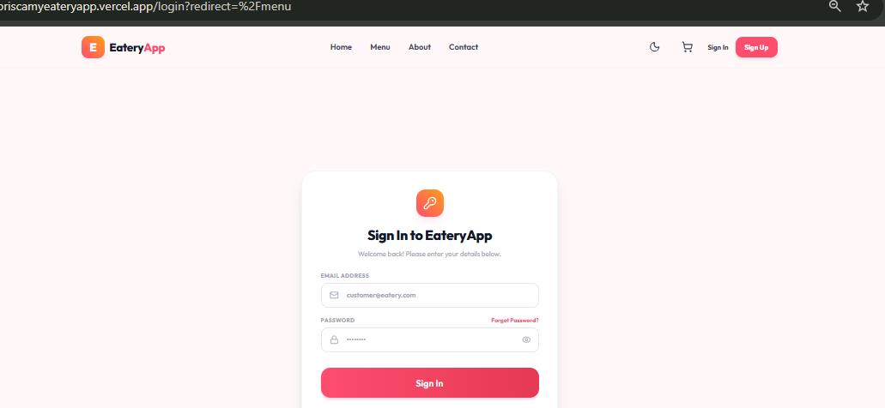
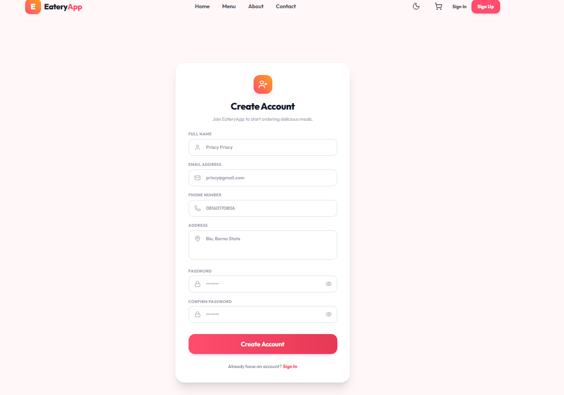
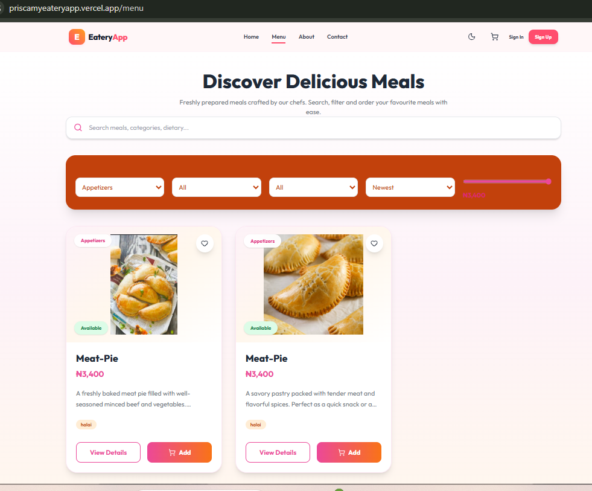
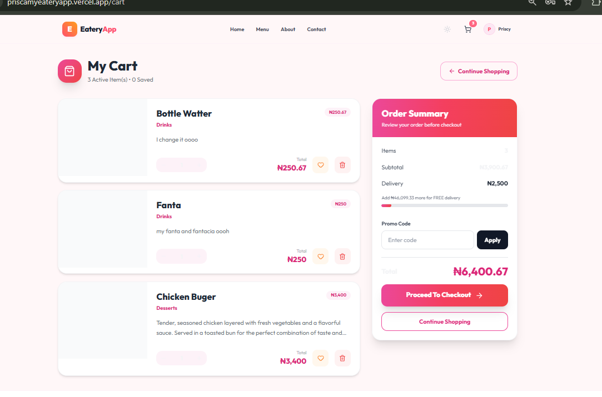
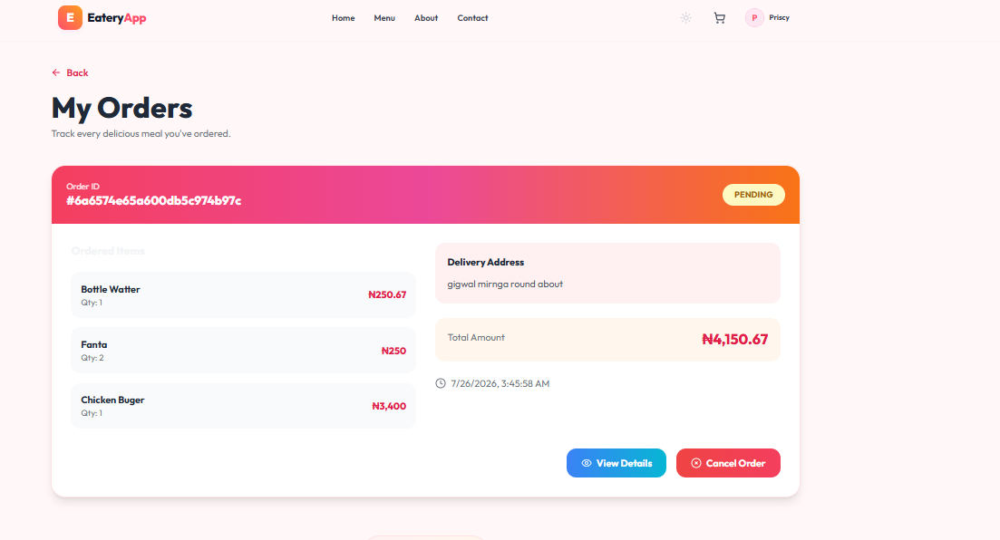
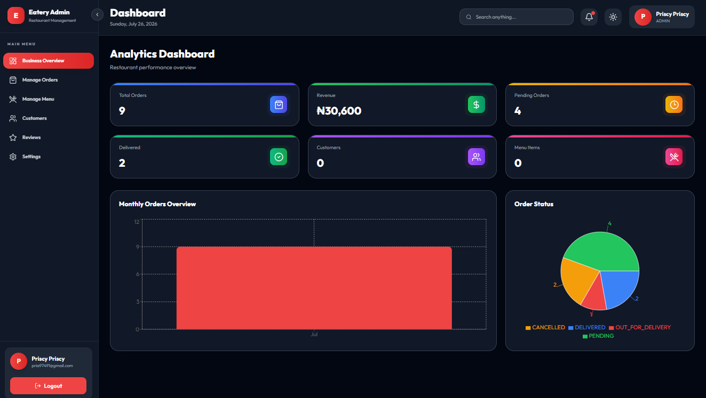

# 🍽️ Online Eatery Frontend

## Project Title

**Online Eatery Frontend – React Food Ordering Application**

---

## Project Description

The Online Eatery Frontend is a responsive web application built with React.js and Vite that provides an intuitive and user-friendly interface for an online food ordering system. The application enables customers to register, log in securely, browse available menu items, place food orders, and track the status of their orders. It also includes a dedicated admin interface for managing menu items, customer orders, and business operations. The frontend communicates with a RESTful backend API to deliver real-time data while providing a fast, responsive, and seamless user experience across desktop and mobile devices.

---

## Live Links

### Frontend (Vercel)

https://priscamyeateryapp.vercel.app/

### Backend API

https://my-backend-eateryapp.onrender.com/

### API Documentation

https://your-api-documentation-link(Later)

---

## Technology Stack

### Frontend

- React.js
- Vite
- JavaScript (ES6+)
- Tailwind CSS
- React Router DOM
- Axios
- React Hook Form
- React Hot Toast
- Framer Motion
- Lucide React

---

## Features

### Customer Features

- User Registration
- User Login
- Secure Authentication (JWT)
- Browse Available Menu Items
- Search for Meals
- View Meal Details
- Place Food Orders
- View Order History
- cancel order if it is still pending
- Responsive User Interface

### Admin Features

- Secure Admin Login
- Dashboard Analytics
- Manage Menu Items
- Manage Customer Orders
- Update Order Status

---

## Installation and Local Setup

### 1. Clone the Repository

```bash
git clone https://github.com/abelprisca/My_Frontend_EateryApp.git
```

### 2. Navigate into the Project

```bash
cd online-eatery-app
```

### 3. Install Dependencies

```bash
npm install
```

### 4. Create a `.env` File

Add the following environment variable:

```env
VITE_API_URL=http://localhost:5000/api for local  or VITE_API_URL=https://my-backend-eateryapp.onrender.com/api after deployment
```

### 5. Start the Development Server

```bash
npm run dev
```

The application will run at:

```
http://localhost:5173
```

---

## Required Environment Variables

The frontend requires the following environment variable:

- VITE_API_URL

> **Note:** Never commit your `.env` file or sensitive information to GitHub.

---

## API Integration

The frontend communicates with the backend through the following API endpoints:

### Authentication

- Login
- Register
- Get User Profile

### Menu

- Retrieve All Menu Items
- Retrieve Menu Item Details

### Orders

- Place Order
- View Customer Orders
- Cancel Order

### Admin

- Dashboard Analytics
- Manage Menu Items
- Manage Customer Orders

For complete API documentation, visit:

i dont know how to get the link 

---

## Screenshots

Include screenshots of the following pages:

- Home Page
- 
- Login Page
- 
- Registration Page
- 
- Menu Page
- 
- Cart Page
- 
- Checkout Page
- Customer Orders Page
- 
- Admin Dashboard
- 
- Manage Menu Page
- Manage Orders Page

Example:

```text

```

---

## Folder Structure

```text
src/
├── assets/
├── components/
├── contexts/
├── hooks/
├── layouts/
├── pages/
├── routes/
├── services/
├── utils/
├── App.jsx
└── main.jsx
```

---

## Known Limitations

The current version of the frontend has the following limitations:

- Online payment integration has not yet been implemented.
- Customer reviews and ratings are not available.
- Password reset functionality is not available.
- Push notifications have not been implemented.
- Offline functionality is not available.

These features are planned for future development.

---

## Author

**Priscilla Abel**

## Submission Information

**Project:** Online Eatery Frontend

**Cohort:**  (7.0).*

**Submission Date:** 26 July 2026

---

## License

This project is developed for educational purposes and is open for learning and demonstration.
